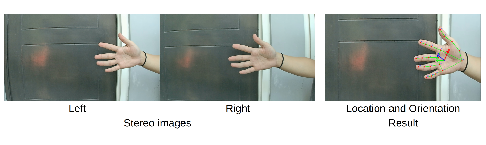
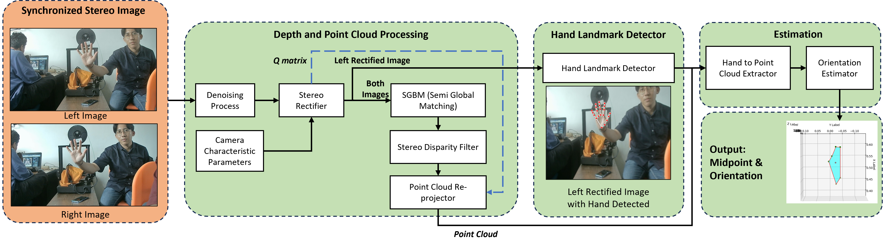

# Hand Orientation Generator

A stereo-vision-based pseudo-dataset generator for estimating hand translation and orientation from stereo images.

This repository provides a research-oriented pipeline for generating pseudo ground-truth labels of hand pose using stereo vision, hand landmarks, disparity-based 3D reconstruction, geometric hand-frame estimation, and temporal quaternion smoothing.

> This project focuses only on pseudo-dataset generation. Model training and PoseCNN-based hand pose estimation will be provided in a separate repository.

---

## Overview

<image>
        
</image>

The main goal of this project is to generate pseudo ground-truth labels for hand pose estimation from stereo image data.

Instead of manually annotating 6D hand pose, this pipeline estimates:

- rectified left image,
- disparity map,
- 2D hand landmarks,
- reconstructed 3D hand landmarks,
- hand translation `[Tx, Ty, Tz]`,
- hand rotation matrix `R`,
- quaternion orientation `[qw, qx, qy, qz]`,
- visualization of hand landmarks and local hand axes.

The generated pseudo labels can later be used as training data for external hand pose estimation models, including PoseCNN-style architectures.

---

## Pipeline

The pseudo-dataset generation pipeline follows these stages:

<image>
        
</image>

---

## Scope of This Repository

This repository is limited to pseudo-dataset generation.

### Included

```text
Stereo image preprocessing
Stereo rectification
Disparity estimation
Hand landmark detection
2D-to-3D landmark reconstruction
Hand coordinate frame estimation
Translation and rotation pseudo-label generation
Quaternion temporal smoothing
CSV and visualization output generation
```

<!-- 
The stereo input is assumed to be a side-by-side image where the left camera image is stored on the left half and the right camera image is stored on the right half. -->

<!-- 
---

## Method Summary

### 1. Stereo Rectification and Disparity Estimation

The input stereo image is first split into left and right camera images. Both images are rectified using stereo calibration parameters.

Disparity is estimated using StereoSGBM and refined using a WLS filter.

The disparity map is then used to reconstruct 3D hand landmark positions using the reprojection matrix `Q`.

---

### 2. Hand Landmark Detection

Hand landmarks are detected from the rectified left image using MediaPipe Hand Landmarker.

The detected 2D landmarks are used as reference points for extracting corresponding 3D coordinates from the disparity-based point cloud.

---

### 3. 2D-to-3D Landmark Reconstruction

For each detected 2D hand landmark, a small local window around the landmark position is sampled from the disparity map.

The median valid 3D point inside the window is used as the reconstructed 3D landmark position.

This step reduces the effect of local disparity noise.

---

### 4. Hand Coordinate Frame Estimation

The local hand coordinate frame is constructed from reconstructed 3D landmarks.
The frame is defined as:

- origin: palm center,
- `Z` axis: palm normal estimated using SVD / plane fitting,
- `Y` axis: wrist-to-middle-MCP direction projected onto the palm plane,
- `X` axis: cross product between `Y` and `Z`.

The resulting rotation matrix is represented as:

```text
R_cam_hand
```

and the translation vector is represented as:

```text
t_cam_hand = [Tx, Ty, Tz]
```

---

### 5. Quaternion Generation

The hand rotation matrix is converted into quaternion format:

```text
[qw, qx, qy, qz]
```

This quaternion represents the estimated hand orientation relative to the camera coordinate frame.

---

### 6. Temporal Quaternion Smoothing

Raw orientation labels may jitter due to disparity noise and palm normal instability.

To reduce frame-to-frame orientation instability, this project applies:

```text
Quaternion sign-continuity correction
+
Normalized exponential moving average smoothing
```

This produces more stable pseudo orientation labels across video frames. -->

---

## Output Structure

The generated pseudo dataset is saved as:

```text
pseudo_dataset_output/
├── img_left/
│   └── rectified left images
├── disparity/
│   └── disparity visualizations
├── landmark/
│   └── 2D and 3D hand landmarks
├── vis_2d_landmark/
│   └── hand landmark and local axis visualizations
└── pseudo_ground_truth_summary.csv
```

---

## Output CSV Format

The main output file is:

```text
pseudo_ground_truth_summary.csv
```

The CSV contains:

```text
filename
relative_path
output_stem
status
valid_landmarks_3d
temporal_smoothing
Tx, Ty, Tz
qw, qx, qy, qz
R00, R01, R02
R10, R11, R12
R20, R21, R22
error
```

If temporal smoothing is enabled, the CSV may also include raw and smoothed pose values.

---

## Installation

Create a Python environment:

```bash
python -m venv .venv
source .venv/bin/activate
```

Install dependencies:

Base install
```bash
pip install -r requirements.txt
```

SAM install
```bash
pip install -r requirements-sam.txt
```

Open3d or for other optional features
```bash
pip install -r requirements-optional.txt
```
---

## Required Files

Before running the pipeline, prepare:

1. stereo side-by-side image folder,
2. stereo calibration file in `.npz` format,
3. MediaPipe `hand_landmarker.task` model.

The calibration file should contain:

```text
K_left
D_left
K_right
D_right
R
T
```

The provided stereo calibration file is for our setup for our own [Stereo HBV Camera](https://www.hbvcamera.com/1MP-%20HD-usb-cameras/hbvcam-ov9732-1mp-hd-face-ar-depth-detection-binocular-synchronous-camera-module.html)

The pipeline computes rectification matrices and the reprojection matrix `Q` internally.

---

## Usage

Example command:

```bash
python data-extraction/pseudo_dataset_extraction_pipeline_nested.py \
  --input-dir /path/to/stereo_image_folder \
  --calib /path/to/calibration.npz \
  --hand-model /path/to/hand_landmarker.task \
  --output-dir pseudo_dataset_output
```

For the temporal smoothing version:

```bash
python data-extraction/pseudo_dataset_extraction_pipeline_nested_temporal.py \
  --input-dir /path/to/stereo_image_folder \
  --calib /path/to/calibration.npz \
  --hand-model /path/to/hand_landmarker.task \
  --output-dir pseudo_dataset_output \
  --rotation-smoothing-alpha 0.2
```

Lower `alpha` values produce smoother orientation labels but may introduce more delay.

Example:

```bash
--rotation-smoothing-alpha 0.1
```

Higher `alpha` values make the labels more responsive but less smooth.

Example:

```bash
--rotation-smoothing-alpha 0.3
```

This is also applicable for translation smoothing.

---

## Notes on Coordinate System

The 3D reconstruction scale follows the stereo calibration scale.

For example, if the chessboard square size during calibration is:

```text
SQUARE_SIZE = 0.03
```

then reconstructed 3D points and translation values are expressed in meters.

---

## Recommended Workflow

```text
1. Calibrate stereo camera
2. Prepare stereo side-by-side images
3. Run pseudo-dataset generation
4. Inspect landmark and axis visualizations
5. Check failed frames in the summary CSV
6. Adjust disparity and smoothing parameters if needed
7. Use generated pseudo labels for downstream model training in a separate repository
```

---

## License

This project is released under the MIT License.

---

# Citation
```bash
@INPROCEEDINGS{10586620,
  author={Setiawan, Dion and Yuniarno, Eko Mulyanto and Purnomo, Mauridhy Hery},
  booktitle={2024 IEEE International Conference on Computational Intelligence and Virtual Environments for Measurement Systems and Applications (CIVEMSA)}, 
  title={Hand Orientation Detection Based on Disparity Maps from Stereo Imagery}, 
  year={2024},
  volume={},
  number={},
  pages={1-6},
  keywords={Three-dimensional displays;Shape;Robot vision systems;Virtual environments;Cameras;Assistive robots;Task analysis;Elderly Assistive Robots;Interaction;Stereo-Vision;3D Hand Tracking},
  doi={10.1109/CIVEMSA58715.2024.10586620}}

```